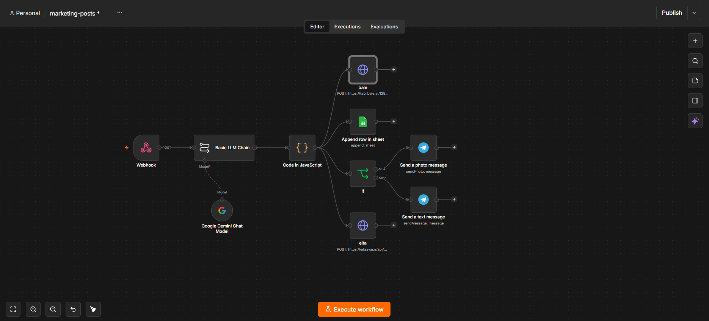

# انتشار خودکار پست‌های وردپرس در تلگرام، بله و ایتا به همراه تولید متای سئو با n8n

این پروژه یک سناریوی عملیاتی برای **ارسال خودکار مقالات منتشرشده در وردپرس به پیام‌رسان‌ها (تلگرام، بله، ایتا)** و تولید متای سئو با کمک هوش مصنوعی است که با **n8n** پیاده‌سازی کرده‌ام.

هدف اصلی این بوده که به محض منتشر شدن یک پست جدید در وب‌سایت، بدون صرف وقت برای کپی-پیست دستی، متن‌های جذاب برای شبکه‌های اجتماعی مختلف تولید شده و هم‌زمان روی تمام کانال‌ها منتشر شوند.

#### این سناریو چه مشکلی را حل می‌کند؟
تیم‌های محتوا و مارکتینگ معمولاً زمان زیادی را صرف تولید خلاصه‌های مختلف از یک مقاله، تنظیم هشتگ‌ها و انتشار جداگانه آن‌ها در پیام‌رسان‌های مختلف می‌کنند. در این اتوماسیون تمام فرآیند از لحظه «انتشار پست» تا «اطلاع‌رسانی کامل» در چند ثانیه و به‌صورت خودکار انجام می‌شود.

---

## Demo

در این ویدیو، نحوه کارکرد زنده سناریو، ارسال داده‌ها از وردپرس و انتشار خودکار در پیام‌رسان‌ها را مشاهده می‌کنید:

https://github.com/user-attachments/assets/5344fa1b-e9a1-46b5-8e03-1ea6e3641066

---

### در این اتوماسیون، تمام مراحل زیر به صورت خودکار انجام می‌شود:

1. **دریافت داده‌ها:** اطلاعات مقاله (عنوان، متن و تصویر شاخص) به محض انتشار در وردپرس از طریق وب‌هوک دریافت می‌شود.
2. **تحلیل و تولید محتوا با هوش مصنوعی:** با کمک مدل **Google Gemini**، متای سئو (Meta Description)، کلمات کلیدی، متن صمیمی برای تلگرام/ایتا/بله و متن تخصصی برای لینکدین تولید می‌شود.
3. **پارس و پاک‌سازی داده‌ها:** با یک نود **JavaScript** اختصاصی، تگ‌های Markdown پاک‌سازی شده و لینک مستقیم مقاله درون متن‌ها جای‌گذاری می‌شود.
4. **تصمیم‌گیری هوشمند برای تصویر:** سیستم بررسی می‌کند که آیا مقاله تصویر شاخص دارد یا خیر؛ در صورت وجود تصویر، پست به همراه عکس ارسال می‌شود و در غیر این صورت به صورت متنی منتشر خواهد شد.
5. **انتشار هم‌زمان:** پیام آماده‌شده به صورت هم‌زمان روی **تلگرام**، **بله** و **ایتا** فرستاده شده و یک نسخه لاگ نیز در **Google Sheets** ذخیره می‌شود.

---

### ابزارها و سرویس‌های استفاده‌شده

* **n8n:** برای مدیریت و اجرای سناریو
* **Google Gemini:** برای تحلیل متن مقاله، تولید متای سئو و ساخت پست‌های شبکه اجتماعی
* **WordPress (WPCode):** برای ارسال اطلاعات مقاله به محض انتشار
* **Telegram Bot:** برای ارسال عکس و متن به کانال تلگرام
* **Bale & Eitaa API:** برای ارسال مستقیم پیام به پیام‌رسان‌های بله و ایتا
* **Google Sheets:** برای ثبت و بایگانی لاگ پست‌های منتشرشده
* **JavaScript:** برای پاک‌سازی، انکودینگ و مدیریت خروجی‌های هوش مصنوعی

---

## پیش‌نمایش سناریو

در تصویر زیر می‌توانید ساختار کامل نودها و جریان داده‌ها را در محیط n8n ببینید:

---

## نحوه استفاده و تست سناریو

اگر می‌خواهید این سناریو را روی n8n خودتان تست کنید:

1. فایل `marketing-posts.json` موجود در همین مخزن را دانلود کنید.
2. در محیط n8n از بخش ویرایشگر، فایل را وارد (Import) کنید.
3. دسترسی‌های مربوط به کلیدهای API گوگل، ربات تلگرام و گوگل شیت را تنظیم کنید.
4. توکن‌ها و Chat IDهای مربوط به بله و ایتا را در نودهای HTTP Request متناسب با پنل خودتان جایگزین کنید.
5. کد PHP ارائه شده را از طریق افزونه **WPCode** روی وردپرس خود قرار داده و آدرس وب‌هوک n8n را در آن تنظیم کنید.
